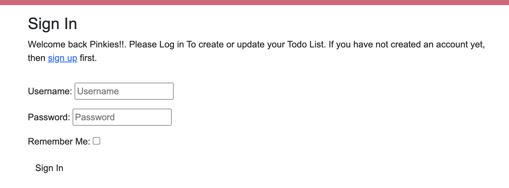

# Lady-Pink-s-Todo-App

A full-stack project built using the Django framework with Python, JavaScript, HTML and CSS. The aim was to create a functional website for users to get their life organised with a todo list app.

# ABOUT

Lady Pink's Todo App is a Todo List App where users can register for an account, create a todo list, update and delete existing todo list. This website is targeted at allowing users organise their daily todo items and providing a more organised way of doing things.

# UX
--
I started with strategy, focusing on the features the target audience would enjoy and find useful.

The target audience for Lady Pink's Todo List App is:

Professionals, busy parents, students

Anyone interested in tracking the progress of their todo list

Anyone looking to simplify their lives 

Anyone looking to achieve productivity and find balance

These users will be looking for:

A clear and informative website, with intuituve navigation and seeing what the website is at first glance.

A UI/UX that is minimalistic and emphasises the content and theme.

The ability to make a user account in order to add and update their todo list.

The ability to log out and login when needed. 

Given the desire to appeal to as broad an audience as possible, UX/UI philosophy will be simple with a focus on content and painless navigation.

# USER STORIES
As a site user I can create an account and log in, so that I can create my own todo list.

As a site user I can delete a todo list once I'm done with the todo list

As a user I can set the priority for my todo list 

As a user I can edit an existing todo list to add more information

As a user I can get confirmation before a todo item is deleted.

As a user my todo information is protected by login authentication.

# Agile Development

To get the minimum viable product I created a kanban board on github and listed all that needed to be done and moved them in order of todo, in progress, and done as the project progressed. This helped me to keep track of where I was lagging behind and where I was ahead.

# WIREFRAMES
All wireframes were created using Balsamiq.

# FEATURES

# Home Page
# Navigation bar: 

The navigation bar appears on every page allowing users to easily navigate through the site.
Navigation bar has links for 'Home', 'Logout' and 'Login/Register'.
Logged in users will also have a 'Logout' and 'home' button highlighted in the navbar.
The navbar is responsive, collapsing into a toggle menu for medium and small screen size.

# Login Page: 

The login page takes users to a new page where they can login to their account to add or update existing todo items, or if they have not registered find a link to register before logging in.

# Logout Page

This page confirms if the user wants to logout of their account which covers any instance where the user made a mistake in clicking the signout button.

# FOOTER

The footer page shows a little message for users to show some love and support and the social media icons where users can click and redirects them to a different page.

# Todo List Page

The todo list page has features such as the delete button which comes up with a pop up to confirm if the user wants to delete the item, an update feature where users can edit the existing todo item, priority function set at low, medium, high for the todo list. 

# Structure
This website is made of just one app: The todo App which handles the functions linked to adding or updating a todo list item.

All Diagrams were created using Lucidchart

# User Flow Diagram

# Database Schema

# Technology Stack

HTML - For page structure

CSS - For custom styling

Python - for the backend

Javascript - for event listeners on buttons

Django - framework used to build this project

Bootstrap 5 - front end framework used for styling

Heroku PostgreSQL - used as the database

Balsamiq - for wireframes

Font Awesome - for social media icons

Lucidchart - for database ER diagrams

Google Fonts- for custom font styling

GitHub - for storing the code and for the Kanban board

Heroku - for hosting and deployement of this project

Git - for version control

# Testing and Validation

# Responsiveness
I used the dev tools on chrome to test the website for responsiveness. I captured screenshots to demonstrate responsive design across mobile, tablet and laptop using UI Dev. On smaller screens the screen collapses to show a toggle bar for the nav links.

# Testing and Validation
I used the W3 HTML Validator  to check the HTML on each of my site pages by Direct Input. However, the only error pointed out was the django language used.

I used the W3 CSS Validator to check my CSS script by Direct Input. I found no errors!.

# Manual Testing Results
# Todo List Page
Test Result

User must be logged in to add new todo item - Pass

User must be logged in to delete todo list - Pass

Users are notified when they log in - Pass

# FOOTER/NAV BAR
Test Result

Navigation links functionality - Pass

Social media links functionality - Pass

# LOGIN PAGE
Test Result

Secure signup functionality - Pass

Redirect after successful login - Pass

# REGISTRATION PAGE
Test Result

Secure login functionality - Pass

Redirect after successful registration - Pass

# LOGOUT PAGE
Test Result

Logout functionality - Pass

Redirect after successful logout - Pass

Message pop up to confirm users have logged out - Pass

# SECURITY
Test Result

Prevention of brute force actions via URL - Pass

Redirect to sign-in page after attempted unauthorized action - Pass

# Known Bugs

There is a bug with the edit button in the todo list page, the user is able to edit the existing todo item but instead of saving the updated todo item the user edited it saves the edited version underneath. 

The desktop rrsponsivity for the website is not picking up the css styling. 

Another Bug that came from the feedback was that forms could be submitted without any input, I was then able to fix this by editing my 'update html' from the manual input which doesnt flag any errors to django automated one which flags errors and calls attention to any required field that needs to be filled out. 

# Deployment
Deployment Guide for Lady Pink's Todo App

Deployment Steps:

Creating the Heroku App

Begin by signing up or logging in to Heroku.

In the Heroku Dashboard, click on 'New' and then select 'Create New App'.

Choose a unique name for your project, like "Travelling Scribbles".

Select the EU region.

Click on "Create App".

In the "Deploy" tab, choose GitHub as the deployment method.

Connect your GitHub account and find/connect your GitHub repository.

# Setting Up Environment Variables

Create env.py in the top level of the Django app.

Import os in env.py.

Set up necessary environment variables in env.py, including the secret key and database URL.

Update settings.py to use environment variables for secret key and database.

Configure environment variables in the Heroku "Settings" tab under "Config Vars".

Migrate the models to the new database connection in the terminal.

Configure static files and templates directories in settings.py.

Add Heroku to the ALLOWED_HOSTS list.

# Creating Procfile and Pushing Changes
Create a Procfile in the top level directory.

Add the command to run the project in the Procfile.

Add, commit, and push the changes to GitHub.

# Heroku Deployment
In Heroku, navigate to the Deployment tab and deploy the branch manually.

Monitor the build logs for any errors.

Upon successful deployment, Heroku will display a link to the live site.

Make sure to resolve any deployment errors by adjusting the code as necessary.

# Credits and Acknowledgement

Code Institute Walkthrough Project

Code with Tomi on Youtube

Django Documentation

Desphixs On Youtube

Dave Gray on Youtube

Ken for pointing out some things to work on with the crud functionality and responsivity of the website.

